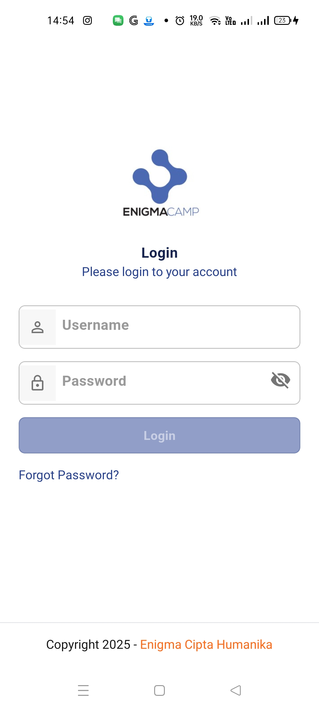
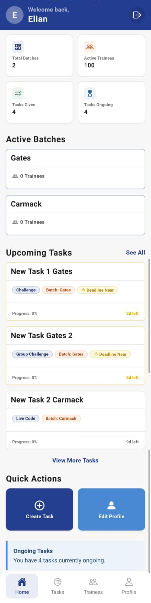
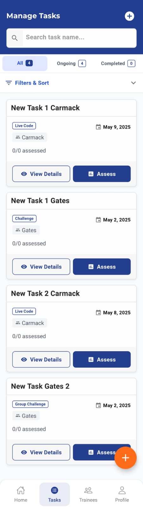
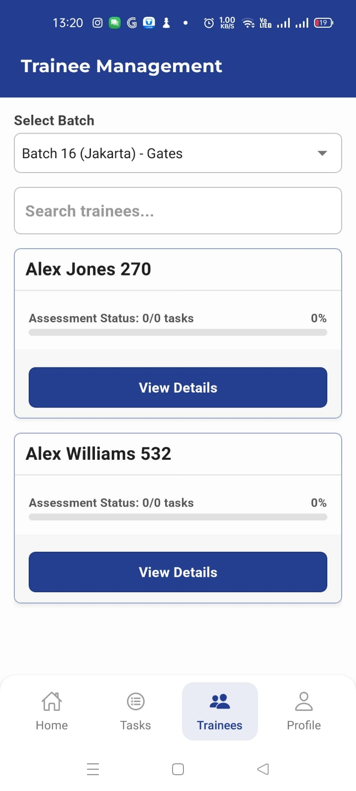
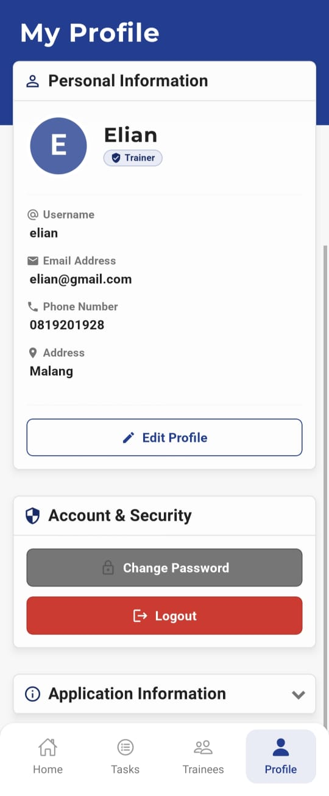
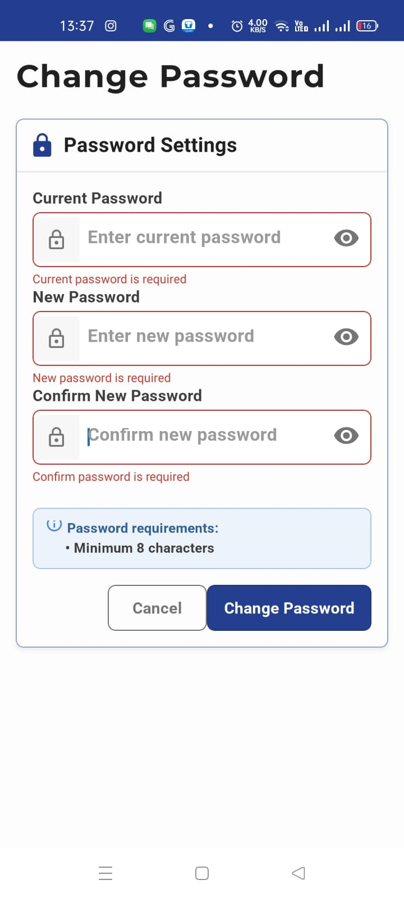

## Overview

Automatic Grading is an application designed to streamline the assessment process for programming assignments. It allows instructors to grade student submissions by simply pasting a GitHub or GitLab repository link. The application automatically clones the repository, runs tests, analyzes code quality, and generates a comprehensive grade report.

Project Video: [https://elianha.my.id/automatic-grading/](automatic-grading)

## Technology
The stack we use:
- **Backend**: Spring Boot Java
- **Fronted Web** : React JS
- **Frontend Mobile** : React Native

## Features

- **Easy Repository Integration**: Grade code by pasting GitHub or GitLab repository URLs
- **Automated Testing**: Runs predefined test suites against submitted code
- **Code Quality Analysis**: Evaluates code style, complexity, and best practices
- **Plagiarism Detection**: Compares submissions against a database to detect potential plagiarism
- **Customizable Rubrics**: Create and use custom grading criteria for different assignments
- **Batch Processing**: Grade multiple submissions simultaneously
- **Detailed Reports**: Generate comprehensive feedback reports for students
- **LMS Integration**: Compatible with popular Learning Management Systems

## Installation

```bash
# Clone this repository
git clone https://github.com/elianhardyy/automatic-grading.git

# Navigate to the project directory
cd automatic-grading

# Install dependencies
npm install

# Configure environment variables
cp .env.example .env
# Edit .env with your specific settings

# Start the application
npm start
```

## Usage

### Basic Usage

1. Log in to the application
2. Create a new assignment with grading criteria
3. Paste the student's repository URL
4. Click "Grade Assignment"
5. Review the generated report
6. Finalize and publish the grade

### Including Images

Images can enhance your README by providing visual documentation or examples. Here's how to include images:

#### Sample Image









## License

This project is licensed under the MIT License - see the [LICENSE](LICENSE) file for details.

## Contact

Elian Hardy - [@elianhardyy](https://github.com/elianhardyy)

Project Link: [https://github.com/elianhardyy/automatic-grading](https://github.com/elianhardyy/automatic-grading)
