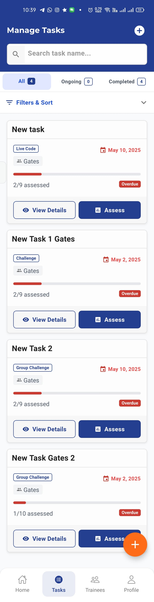
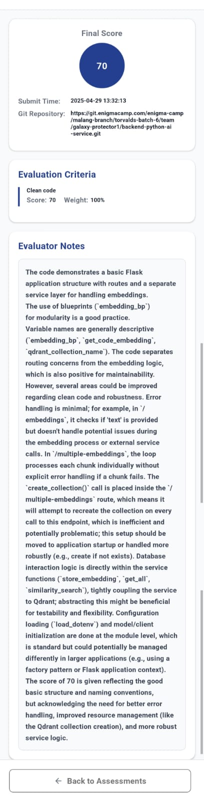

# Automatic Grading

## Overview

**Automatic Grading** is an application designed to streamline the assessment process for programming assignments. It allows instructors to grade student submissions by simply pasting a GitHub or GitLab repository link. The application automatically clones the repository, runs tests, analyzes code quality, and generates a comprehensive grade report.

📽️ **Project Demo**:  
<a href="https://elianha.my.id/automatic-grading/" target="_blank" rel="noopener noreferrer">View the Automatic Grading Demo</a>

## Technologies Used

- **AI** : Gemini AI
- **Backend**: Spring Boot (Java)
- **Frontend Web**: React.js
- **Frontend Mobile**: React Native

## Features

- 🚀 **Easy Repository Integration** – Grade code by pasting GitHub or GitLab repository URLs
- 🧠 **Code Quality Analysis** – Evaluates code style, complexity, and best practices
- 🧩 **Plagiarism Detection** – Compares submissions against a database to detect potential plagiarism
- 📝 **Customizable Rubrics** – Create and use custom grading criteria for different assignments
- 📦 **Batch Processing** – Grade multiple submissions simultaneously
- 📊 **Detailed Reports** – Generate comprehensive feedback reports for students

## Installation

```bash
# Clone this repository
git clone https://github.com/elianhardyy/automatic-grading.git

# Navigate to the project directory
cd automatic-grading

# Install dependencies
npm install

# Configure environment variables
cp .env.example .env
# Edit .env with your specific settings

# Start the application (for mobile)
npm run android
# Start the application (for mobile)
npm run android
```

## Usage

### Basic Workflow

### Basic Workflow

1. Log in to the application
2. Create a new assignment with grading criteria
3. Paste the student's repository URL
4. Click **"Grade Assignment"**
5. Review the generated report
6. Finalize and publish the grade

## Screenshots








## License

This project is licensed under the MIT License – see the [LICENSE](LICENSE) file for details.
This project is licensed under the MIT License – see the [LICENSE](LICENSE) file for details.

## Contact

Created by [**Elian Hardy**](https://github.com/elianhardyy)  
🔗 **Project Repository**: [github.com/elianhardyy/automatic-grading](https://github.com/elianhardyy/automatic-grading)
Created by [**Elian Hardy**](https://github.com/elianhardyy)  
🔗 **Project Repository**: [github.com/elianhardyy/automatic-grading](https://github.com/elianhardyy/automatic-grading)
